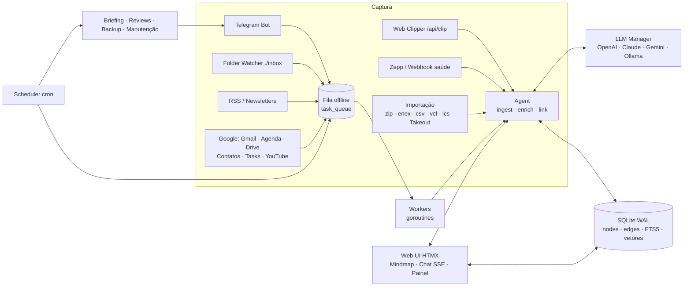

# 🧠 Second Brain

> Um "segundo cérebro" autônomo, auto-hospedado e distribuído como **binário único** em Go.
> Captura conhecimento por Telegram, web clipper, pasta monitorada, RSS, Google (Agenda, Gmail, Drive, Contatos, Tasks, YouTube) e Google Takeout, organiza tudo num **grafo de conhecimento** com IA (auto-tagging, auto-linking, busca híbrida) e trabalha por você com briefings, revisões e backups cifrados.

[](https://github.com/inakano89/second-brain/actions/workflows/ci.yml)


[](LICENSE)
[](https://github.com/inakano89/second-brain/releases)

**Open source (MIT)** · auto-hospedado · seus dados ficam na sua máquina.

---

## Sumário

- [Destaques](#destaques)
- [Arquitetura](#arquitetura)
- [Instalação](#instalação)
- [Guia para leigos](#guia-para-leigos)
- [Primeiro acesso](#primeiro-acesso-setup-wizard)
- [Interface web](#interface-web)
- [Canais de captura](#canais-de-captura)
- [Importação de dados](#importação-de-dados)
- [Gerenciar conteúdo](#gerenciar-conteúdo)
- [Modelos de IA e Conselho](#modelos-de-ia-e-conselho)
- [IA, grafo e agentes](#ia-grafo-e-agentes)
- [Memória, tarefas de reuniões e faxina](#memória-tarefas-de-reuniões-e-faxina)
- [Integrações](#integrações)
- [Rotinas agendadas](#rotinas-agendadas)
- [Backup e restauração](#backup-e-restauração)
- [Atualizações automáticas](#atualizações-automáticas)
- [API REST](#api-rest)
- [Configuração (.env)](#configuração-env)
- [Segurança](#segurança)
- [Desenvolvimento](#desenvolvimento)
- [Limitações conhecidas](#limitações-conhecidas)
- [Contribuindo](#contribuindo)
- [Licença](#licença)

---

## Destaques

| Área | O que faz |
|---|---|
| **Binário único** | Go puro (`CGO_ENABLED=0`), templates/HTMX/CSS/JS embutidos via `embed.FS`, timezone database embutida. Roda em VPS, SBC ARM 32-bit (Armbian) e Windows. |
| **Banco** | SQLite via `modernc.org/sqlite` em modo **WAL**, índice **FTS5** (`unicode61 remove_diacritics`), grafo (`nodes`/`edges`), vetores, métricas, audit log e fila offline. |
| **LLM universal** | OpenAI, Anthropic Claude, Google Gemini e LLM local (Ollama / llama.cpp / LM Studio via API compatível com OpenAI) com **streaming**, **function calling** e **multimodal** (imagem, PDF, áudio). |
| **Modelos por tarefa + Conselho** | Catálogo de modelos gerenciável pela UI, um padrão por empresa e um modelo (ou o **🤝 Conselho**, em que Claude, GPT e Gemini debatem e um moderador decide) para cada tarefa. |
| **Grafo de conhecimento** | Nós tipados (Notas, Tarefas, Pessoas, Eventos, Insights, Artigos, Saúde), auto-tagging, extração de entidades/tarefas, auto-linking semântico, `[[wiki-links]]`. |
| **Busca híbrida** | BM25 (FTS5) + similaridade vetorial executadas em paralelo e fundidas por *Reciprocal Rank Fusion*, com filtros de tipo, data e tag. |
| **Captura multicanal** | Bot Telegram (texto, voz → transcrição, foto → OCR), bookmarklet/web clipper, pasta `inbox` (fsnotify), RSS, Gmail e newsletters, Google Agenda/Drive/Contatos/Tasks/YouTube. |
| **Importação** | Obsidian, Logseq, Notion, Evernote, Google Keep, Joplin/Bear, favoritos do navegador/Pocket, CSV (Excel, Todoist, Readwise), JSON, Kindle, contatos (vCard), agenda (iCalendar), OPML e **Google Takeout** (histórico do YouTube, pesquisas, Chrome, Linha do tempo do Maps, lugares salvos, Play Store) — com detecção automática, `.zip` aninhados e reimportação sem duplicar. |
| **Gerenciar conteúdo** | Página **Conteúdo** com filtros (texto, tipo, origem, tag, data, envio), seleção em massa (inclusive todos os resultados do filtro), apagar/etiquetar/mudar tipo/concluir/reprocessar/exportar em lote, filtros de faxina (duplicados, sem conteúdo, sem conexões), aba **Faxina** com as sugestões semanais, apagar uma importação inteira e **lixeira de 30 dias** com desfazer. Itens apagados não voltam nas sincronizações. |
| **Camada de ação e memória** | Tarefas extraídas de atas, transcrições e notas de reunião duas vezes por dia (com lista do que surgiu, inclusive dos e-mails); memória diária de **decisões, aprendizados e prioridades** que o chat e o briefing consultam; **faxina semanal** que sugere duplicados para juntar, itens vazios, tarefas paradas e pessoas soltas para você aprovar. |
| **Rotinas** | Briefing matinal (sono + agenda + pendências), balanço noturno, weekly review, manutenção do SQLite e backup cifrado AES-256-GCM para local/S3/WebDAV/Telegram. |
| **Resiliência offline** | Toda chamada externa passa por uma fila persistente no SQLite com *retry* e *backoff* exponencial. |
| **Auto-update** | Instala novas releases do GitHub sozinho (SHA-256 + assinatura ed25519 opcional, snapshot do banco, rollback automático). Desativável em Configurações. |
| **Painéis** | Mapa com **Visão geral** em órbitas (tipos, temas, rotinas e fontes) e **Rede** detalhada (canvas, sem dependências), chat streaming com seletor de modelo, painel de custos por provedor, audit log, editor do `.env` e exportação para **Obsidian**. |

---

## Arquitetura



```
cmd/server/main.go            inicialização, onboarding, supervisor de serviços, rebind de porta
internal/
  config/                     .env com RWMutex + lock de arquivo + escrita atômica; schema de variáveis
  database/                   SQLite (modernc), migrações, FTS5, grafo, índice vetorial, fila, logs, métricas
  llm/                        cliente unificado (streaming SSE, tools, multimodal), embeddings, preços
  agent/                      ingestão, auto-tagging/linking, busca híbrida, chat RAG + tools, ações (webhook/MQTT/comando)
  telegram/                   bot (long polling), mídia, transcrição, OCR, notificações
  integrations/google/        OAuth2 por serviço, Agenda, Gmail (+ newsletters, rascunhos), Drive, Contatos, Tasks, YouTube
  integrations/takeout/       leitor do Google Takeout (Minha Atividade, Chrome, Linha do tempo, Maps, Play) → notas mensais
  integrations/zepp/          métricas de sono/FC/passos (API Huami) + estimativa de recuperação
  integrations/rss/           parser RSS/Atom/RDF e curadoria por relevância
  watcher/                    monitor fsnotify da pasta inbox
  importer/                   importação (Obsidian, Notion, Evernote, Keep, favoritos, CSV, JSON, Kindle, vCard, iCal, OPML)
  scheduler/                  cron interno, rotinas diárias/semanais, manutenção, backup cifrado (S3 SigV4/WebDAV/Telegram)
  queue/                      pool de workers da fila offline
  extract/                    Readability simplificado, HTML→Markdown, texto de PDF
  export/                     vault Obsidian (.zip) com frontmatter YAML e [[links]]
  crypto/                     Argon2id, AES-256-GCM em streaming
  updater/                    auto-update via GitHub Releases, verificação, troca atômica, restart e rollback
  web/                        handlers HTTP, setup wizard, SSE, templates HTMX e assets embutidos
cmd/signer/                   gera chaves e assina SHA256SUMS das releases (ed25519)
```

---

## Instalação

### Linux em 1 comando (VPS, Raspberry/Orange Pi)

```bash
curl -fsSL https://raw.githubusercontent.com/inakano89/second-brain/main/deploy/install.sh | sudo bash
```

O script detecta a arquitetura (x86-64, ARM64, ARMv7), baixa a última release e confere o SHA-256. Depois instala em `/opt/second-brain`, cria o usuário `brain` e um serviço systemd com hardening. Rodar de novo atualiza o binário.

### Binário pré-compilado

Baixe o binário da sua plataforma em **[Releases](https://github.com/inakano89/second-brain/releases)**:

| Plataforma | Arquivo |
|---|---|
| Linux x86-64 (VPS Ubuntu/Debian) | `second-brain-linux-amd64` |
| Linux ARM64 (Oracle Ampere, Hetzner CAX, Raspberry Pi OS 64-bit) | `second-brain-linux-arm64` |
| Linux ARMv7 32-bit (Armbian, Raspberry Pi OS 32-bit, Orange Pi…) | `second-brain-linux-armv7` |
| Windows x64 | `second-brain-windows-amd64.exe` |

```bash
chmod +x second-brain-linux-amd64
mkdir -p ~/brain && cd ~/brain
~/second-brain-linux-amd64 -env ./.env
# abra http://SEU_IP:8080 → você será redirecionado para /setup
```

> Todos os caminhos relativos (`DATA_DIR`, `INBOX_DIR`, `ACTIONS_FILE`) são resolvidos a partir da pasta do `.env`.

**Windows (PC que não fica ligado 24/7):** dois cliques no `.exe` abrem o servidor numa janela de console e o navegador; um segundo clique só reabre o navegador (instância única). Em **Configurações → Este computador** (ou `second-brain.exe -autostart on`) o Second Brain passa a iniciar no login do usuário, sem janela (chave `HKCU\Software\Microsoft\Windows\CurrentVersion\Run` com `-background`; log em `DATA_DIR/second-brain.log`). O botão **Encerrar o Second Brain** fica na mesma seção. Rotinas perdidas com o PC desligado são recuperadas ao ligar (veja [Rotinas agendadas](#rotinas-agendadas)).

### Docker

A imagem é multi-arch (`linux/amd64`, `linux/arm64`, `linux/arm/v7`), baseada em `scratch`, e tem `HEALTHCHECK`.

**Com domínio e HTTPS automático (Caddy + Let's Encrypt)** — recomendado para VPS:

```bash
mkdir -p ~/second-brain && cd ~/second-brain
curl -fsSLO https://raw.githubusercontent.com/inakano89/second-brain/main/deploy/docker-compose.https.yml
curl -fsSLO https://raw.githubusercontent.com/inakano89/second-brain/main/deploy/Caddyfile
echo "DOMAIN=brain.seudominio.com" > .env      # DNS A → IP da VPS; portas 80/443 liberadas
docker compose -f docker-compose.https.yml up -d
```

**Só IP e porta:**

```bash
docker run -d --name second-brain -p 8080:8080 -v brain-data:/data --restart unless-stopped \
  ghcr.io/inakano89/second-brain:latest
```

Ou use `docker compose up -d` com o [`docker-compose.yml`](docker-compose.yml) do repositório.

- Os dados (`.env`, banco, backups, mídia) ficam no volume `/data`.
- **As atualizações automáticas também funcionam no Docker.** O binário novo é salvo em `/data/data/bin/`, e a imagem passa a executá-lo nos próximos inícios, com rollback se ele falhar. Um `docker compose pull` que traga uma imagem mais nova tem prioridade.
- Para redefinir a senha: `docker compose exec second-brain /second-brain -env /data/.env -reset-password`.
- A imagem `scratch` não tem shell. Por isso as ações do tipo `command` só funcionam com o binário nativo.

### Compilando do código-fonte

Requer Go 1.26+ (desenvolvido e testado com Go 1.27.1).

```bash
git clone https://github.com/inakano89/second-brain && cd second-brain
make check      # vet + testes + verifica compilação de todos os alvos (sem gerar artefatos)
make release    # dist/second-brain-{linux-amd64,linux-arm64,linux-armv7,windows-amd64.exe} + SHA256SUMS
make sign       # assina dist/SHA256SUMS com UPDATE_SIGNING_KEY (opcional)
make docker-buildx IMAGE=ghcr.io/voce/second-brain
```

### Serviço systemd (VPS / Armbian)

```ini
# /etc/systemd/system/second-brain.service
[Unit]
Description=Second Brain
After=network-online.target
Wants=network-online.target

[Service]
User=brain
WorkingDirectory=/opt/brain
ExecStart=/opt/brain/second-brain -env /opt/brain/.env
Restart=always
RestartSec=5
NoNewPrivileges=true
ProtectSystem=strict
ReadWritePaths=/opt/brain

[Install]
WantedBy=multi-user.target
```

```bash
sudo systemctl daemon-reload && sudo systemctl enable --now second-brain
journalctl -u second-brain -f
```

Para expor na internet, use um proxy reverso com TLS (Caddy, nginx, Traefik) e defina `PUBLIC_URL=https://…`. Para SSE funcionar no nginx, desabilite buffering (`proxy_buffering off;`).

### Parâmetros de linha de comando

| Flag | Uso |
|---|---|
| `-env caminho` | arquivo `.env` (padrão `./.env`) |
| `-version` | mostra a versão |
| `-update` | verifica e instala a última release e sai |
| `-reset-password` | define nova senha de administrador (lê do terminal) |
| `-reset-setup` | reabre o assistente `/setup` |
| `-decrypt arquivo.enc -out brain.db [-key …]` | restaura um backup cifrado |
| `-healthcheck` | retorna 0 se o servidor local responde (usado pelo Docker) |
| `-import arquivo [mais arquivos…]` | importa e sai (até 2 GB por arquivo). Opções: `-import-llm`, `-import-fetch`, `-import-tags a,b` |
| `-autostart on\|off` | Windows: liga/desliga o início automático no login (sem janela) |
| `-background` | Windows: roda sem janela de console, com log em `DATA_DIR/second-brain.log` (usado pelo início automático) |

---

## Guia para leigos

A interface tem uma página **❓ Ajuda** (`/help`), acessível até antes do setup. Ela traz passo a passo com links diretos para:

- obter as chaves de API do Claude, GPT e Gemini;
- instalar um modelo local;
- criar o bot do Telegram;
- configurar o Google (Agenda, Gmail, Drive, Contatos, Tasks, YouTube) e importar o Google Takeout;
- configurar Zepp, RSS, Web Clipper e backup em S3/WebDAV/Telegram;
- instalar em VPS com ou sem Docker e configurar HTTPS com domínio;
- resolver os problemas mais comuns.

Os formulários de setup e de configurações têm links “❓ como configurar” para a seção certa.

---

## Primeiro acesso (Setup Wizard)

Enquanto o `.env` não existir ou `SETUP_COMPLETED=false`, **toda requisição é redirecionada para `/setup`**. O formulário coleta:

1. **Identificação** — nome do cérebro, usuário e senha mestre (hash **Argon2id**).
2. **Servidor** — porta HTTP (padrão `8080`, migração de porta sem reiniciar), timezone, URL pública e atualizações automáticas (marcado por padrão).
3. **Provedores LLM** — chaves OpenAI, Anthropic, Gemini e endpoint local compatível com OpenAI.
4. **Telegram** — token do bot e `ALLOWED_TELEGRAM_USER_IDS`.
5. **Google** — Client ID/Secret para OAuth2 (Agenda, Gmail, Drive, Contatos, Tasks, YouTube).
6. **Zepp / Amazfit** — e-mail/senha ou app token + user ID.
7. **Chave mestre AES-GCM** — para backups (gerada automaticamente se vazia e exibida uma única vez).

Ao concluir, são gerados `SESSION_SECRET` e `API_TOKEN`, os serviços de fundo são iniciados e você é autenticado automaticamente.

Para refazer o onboarding: `second-brain -env .env -reset-setup`.

---

## Interface web

| Página | Recursos |
|---|---|
| **Mindmap** (`/`) | Duas visões. **Visão geral** (padrão, SVG): o cérebro no centro e anéis concêntricos com rotinas (situação de cada uma), tipos de conteúdo, temas mais frequentes e fontes (Telegram, Gmail, Drive, Takeout…), com tamanho proporcional à quantidade; as ligações aparecem só ao passar o mouse, e o clique lista os itens no painel lateral (`/api/overview`, `/overview/nodes`). **Rede**: grafo force-directed em canvas (JS puro, embutido), carregado só quando aberto: zoom, pan, arrastar nós, duplo clique expande vizinhos, legenda filtra tipos; o botão “Ver na rede” abre a rede já filtrada. Cores dos tipos em paleta segura para daltonismo, com tons próprios para os temas claro e escuro. Busca híbrida com filtros de tipo, data e tag. Painel de detalhes com Markdown, conexões, edição, conclusão de tarefas, reprocessamento por IA e exclusão (vai para a lixeira, com desfazer). Captura rápida. |
| **Conteúdo** (`/content`) | Gerenciador de tudo o que entrou: lista filtrável e paginada, ações em massa, painel de leitura/edição, abas **Envios** e **Lixeira**. Veja [Gerenciar conteúdo](#gerenciar-conteúdo). |
| **Chat** (`/chat`) | Streaming via SSE, seletor dinâmico de modelo (`provedor` ou `provedor:modelo`), anexos (imagem/PDF/texto), injeção automática de contexto do grafo e chamadas de ferramentas visíveis. |
| **Painel** (`/dashboard`) | No topo: indicadores (capturas e concluídas na semana com variação, tarefas abertas e atrasadas, novas da IA em 24 h, faxina pendente, custo de IA), **briefing de hoje**, **A fazer** (atrasadas, de hoje e tarefas novas da IA com a origem, concluir ✓ ou descartar ✕), **prioridades atuais**, **decisões e aprendizados** recentes e capturas por dia (14 dias, com tooltip e tabela). Abaixo: custos e tokens por provedor/modelo (7/30/90 dias), estatísticas do grafo, integrações, fila offline, rotinas com execução manual e métricas de saúde. |
| **Importar** (`/import`) | Envio de um ou vários arquivos, detecção automática do formato, progresso ao vivo e relatório (novos, atualizados, sem mudança, apagados antes, falhas, conexões), com link para revisar o envio no Conteúdo. Tabela com o passo a passo de exportação de cada app. |
| **Audit log** (`/logs`) | Execuções, erros de sync, ações do agente e logins, filtráveis por nível/componente/texto. |
| **Configurações** (`/settings`) | Liga/desliga de atualizações automáticas, verificação/instalação manual, editor completo do `.env` (segredos mascarados), conexão Google, bookmarklet e API token, editor de ações do agente, backup manual, download de backups, exportação Obsidian e troca de senha. |

---

## Canais de captura

### Telegram

1. Crie um bot com [@BotFather](https://t.me/BotFather) e informe o token em Configurações.
2. Envie `/start` ao bot. Ele responde com seu ID e você aparece em **Configurações → Telegram → Aguardando autorização**. Clique em **Autorizar**. (Também dá para preencher `ALLOWED_TELEGRAM_USER_IDS` manualmente.)
3. Mensagens de quem não foi autorizado são ignoradas e registradas no audit log.

| Entrada | Comportamento |
|---|---|
| Texto livre | Conversa contínua com o assistente (histórico por chat, RAG, ferramentas). A resposta é transmitida editando a mensagem. |
| 🎙️ Voz / áudio | Download do `.ogg` → transcrição (Whisper ou Gemini Audio) → nota categorizada (pode virar tarefa/insight) → grafo. |
| 🖼️ Foto | Visão multimodal (Gemini / Claude / GPT-4o): OCR, descrição e tabelas em Markdown. |
| 📄 Documento | PDF (texto local ou OCR multimodal para digitalizados), Markdown, TXT, HTML. |
| Comandos | `/note`, `/task`, `/event` (linguagem natural → Google Calendar), `/search`, `/tasks`, `/done <id>`, `/brief`, `/model` (lista; `/model council` ativa o Conselho), `/reset`. |

Mídia é processada pela fila offline: sem conexão com o LLM, o bot avisa e reprocessa automaticamente.

### Web Clipper (bookmarklet)

Em **Configurações → Web Clipper**, arraste o botão **🧠 Salvar no Brain** para a barra de favoritos. Com texto selecionado, salva a seleção; sem seleção, o servidor baixa a página, extrai o conteúdo principal (Readability simplificado), gera sumário e cria o nó `article`.

### Folder watcher

Arquivos colocados em `INBOX_DIR` (padrão `./inbox`) são detectados via **fsnotify** (com *debounce* até o tamanho estabilizar) e processados: `.md` (frontmatter YAML respeitado), `.txt`, `.pdf`, `.html`, imagens e áudio. Arquivos `.zip` (Obsidian, Notion, Google Takeout…) vão para o [importador](#importação-de-dados) pela fila, sem o limite de `IMPORT_MAX_MB`. Depois vão para `inbox/.archive/AAAA-MM/` ou são apagados (`WATCHER_ACTION=delete`). Falhas permanentes vão para `.archive/failed/`.

### RSS e newsletters

`RSS_FEEDS` (um por linha) é consultado em paralelo; itens novos (≤ 7 dias) são pontuados em lote pelo LLM segundo `RSS_INTERESTS`, e os com nota ≥ `RSS_MIN_SCORE` viram artigos resumidos. Newsletters do Gmail (`GMAIL_NEWSLETTER_QUERY`) são resumidas em tópicos.

---

## Importação de dados

Página **Importar** (`/import`), `POST /api/import` ou `second-brain -import arquivo.zip`. O formato é detectado pelo nome e pelo conteúdo; um `.zip` é percorrido por inteiro (inclusive `.zip` dentro de `.zip`, como no export do Notion e no Google Takeout) e cada arquivo interno vai para o leitor certo.

| Fonte | Arquivo | Vira |
|---|---|---|
| Obsidian, Logseq, Joplin, Bear, Markdown | `.md` ou pasta compactada em `.zip` | notas; frontmatter YAML (`title`, `tags`, `aliases`, `created`, `type`, `status`, `due`), propriedades `key:: value` do Logseq, `#tags` e `[[links]]` preservados. Notas diárias (`2024-01-15.md`) recebem a data. |
| Notion | `.zip` (Markdown & CSV) | páginas viram notas; IDs dos nomes são removidos e links entre páginas viram `[[wiki-links]]`. Os CSV de bancos de dados são ignorados (as linhas já vêm como páginas). |
| Evernote | `.enex` | notas com tags, datas, URL de origem e checklists (`- [x]`); lido em streaming (anexos não ocupam memória). |
| Google Keep | Takeout `.zip` ou `.json` | notas e listas; lixeira ignorada, marcadores viram tags. |
| Favoritos (Chrome, Firefox, Edge, Safari), Pocket, Raindrop | `.html` | artigos; a pasta vira tag. Opção de baixar o texto de cada página pela fila. |
| Planilhas: Excel, Google Sheets, Todoist, Readwise, Goodreads, Pocket | `.csv`/`.tsv` (`,` `;` ou tab) | uma nota/tarefa por linha. Colunas reconhecidas em pt/en (título, conteúdo, tags, tipo, url, prazo, data, status); as demais vão para o conteúdo. CSV do Todoist tem leitor próprio (seções, `@labels`, comentários). |
| JSON / JSON Lines | `.json`, `.jsonl` | um nó por objeto (mesmos campos; aceita a resposta da própria API). |
| Kindle | `My Clippings.txt` | um artigo por livro com destaques e notas (pt/en, duplicatas removidas). |
| Contatos (Google, iPhone, Outlook) | `.vcf` (2.1/3.0/4.0) | pessoas; se a pessoa já existe no grafo, os dados são mesclados. |
| Agenda (Google Agenda, Outlook, Apple) | `.ics` | eventos (fuso, dia inteiro, recorrência, participantes como `[[links]]`) e tarefas `VTODO`; cancelados ignorados. |
| OPML (Feedly, Inoreader, Workflowy) | `.opml` | assinaturas vão para `RSS_FEEDS`; tópicos viram notas. |
| Páginas HTML | `.html` | notas com o texto principal (Readability). |
| Google Takeout | `.zip` ou `Timeline.json` | histórico do YouTube, pesquisas, Chrome, Linha do tempo, lugares do Maps e Play Store em notas mensais/listas (veja [Google Takeout](#google-takeout)). |

Como funciona:

- **Sem duplicar**: cada item recebe uma chave estável (`source=import:<formato>`, `source_ref` = caminho no vault, UID, URL ou hash). Reimportar atualiza o que mudou e pula o resto — inclusive o que você [apagou](#gerenciar-conteúdo) com “Não trazer de volta” (contado como “apagados antes”).
- **Lotes**: cada importação grava `import_batch`, `import_name` e `import_at` no `meta` dos itens, o que permite listar, revisar e apagar um envio inteiro em **Conteúdo → Envios**.
- **Conexões**: `[[links]]` são resolvidos pelo nome do arquivo, `aliases` ou título dentro da própria importação; o vault exportado pelo Second Brain volta com as conexões tipadas da seção “Conexões”.
- **Custo controlado**: por padrão o enriquecimento usa a análise offline (tags, resumo heurístico, embeddings e auto-links). Marque **Analisar com IA** (ou `llm=true`, `-import-llm`) para resumo/entidades por LLM — ~1 chamada por item. O botão “Reprocessar” de um nó sempre usa a IA.
- **Paralelismo**: arquivos e entradas do `.zip` são lidos em goroutines (1 por CPU); a gravação usa 4 workers; o enriquecimento segue pela fila offline.
- **Limites**: `IMPORT_MAX_MB` (padrão 200 MB por envio). Atrás de nginx, ajuste `client_max_body_size`. Para arquivos maiores use `-import` no servidor. Anexos (imagens, PDFs) dentro de exports são ignorados — use a pasta `inbox` para eles.

---

## Gerenciar conteúdo

Página **Conteúdo** (`/content`), no menu. Serve para revisar, corrigir e limpar o que foi enviado — por exemplo, apagar centenas de favoritos importados de uma vez.

- **Filtros**: busca no título e no texto (todas as palavras, prefixo, sem acentos, via FTS5), tipo, origem (canal/integração/formato de importação), tag, situação da tarefa, período de criação, ordem (recentes, antigos, editados, título). O endereço da página acompanha os filtros, então dá para salvar a busca nos favoritos.
- **Faxina**: atalhos para **Duplicados** (mesmo tipo e título, lado a lado), **Sem conteúdo** e **Sem conexões**, com a contagem de cada um.
- **Seleção**: caixa por linha, clique na linha, <kbd>Shift</kbd>+clique para intervalos, “selecionar a página” e **“selecionar todos os N resultados do filtro”** (até 20 000 por ação). A seleção sobrevive à paginação e é zerada quando o filtro muda.
- **Ações em massa** (barra fixa no topo): **Apagar** (com **Não trazer de volta** marcado por padrão), **+ Tag / − Tag** (várias separadas por vírgula), **Mudar tipo**, **Concluir / Reabrir** tarefas, **Reprocessar IA** (até 1 000 por vez; pede confirmação por causa do custo) e **Exportar** a seleção como vault Obsidian (`.zip`, só com as conexões internas). Cada ação roda numa transação por bloco de 400 itens.
- **Painel lateral**: clique no título para ler, editar, apagar ou ver as conexões sem sair da lista; clicar numa tag do painel filtra a lista por ela.
- **Envios** (`/content/sends`): importações agrupadas por arquivo (com data e quantidade) e totais por origem, cada um com **Ver itens** e **Apagar envio/tudo**.
- **Lixeira** (`/content/trash`): tudo o que foi apagado — pela página Conteúdo, pelo painel do mapa ou por envio — fica **30 dias** restaurável, por item ou por lote (a nota volta com as mesmas conexões; os embeddings são refeitos pela fila). **Desfazer** aparece logo após apagar. A rotina `maintenance` remove de vez os itens com mais de 30 dias e os arquivos de mídia deles; também dá para **apagar de vez** ou **esvaziar** manualmente.

**Não trazer de volta**: ao apagar com a opção marcada, a chave de origem do item (`source` + `source_ref`, ou o nome para pessoas criadas automaticamente a partir de menções) vai para a tabela `deleted_refs`. A partir daí `agent.Ingest` recusa o item com `database.ErrDeleted` para integrações e importações (Gmail, Agenda, Drive, Contatos, Tasks, YouTube, RSS, Zepp, rotinas, tarefas extraídas pela IA, reimportações e Takeout do Drive), que o tratam como “pular”; a fila marca a tarefa como concluída. Canais em que você envia algo à mão (Telegram, voz, web, API, Web Clipper e pasta `inbox`) levantam o bloqueio e trazem o item de volta. O bloqueio continua depois que o item sai da lixeira; **Lixeira → Permitir que voltem** limpa todos. Restaurar um item também remove o bloqueio dele.

---

## Modelos de IA e Conselho

Tudo é gerenciado na página **Modelos** (`/models`) e gravado no `.env`:

| Recurso | Como funciona |
|---|---|
| **Catálogo** (`LLM_MODELS`) | Lista `provedor:modelo`. Adicione ou remova pela UI. O botão “Ver modelos disponíveis na sua conta” consulta a API de cada provedor. |
| **Lista recomendada** ([`internal/llm/models.json`](internal/llm/models.json)) | Modelos, padrões e preços mantidos neste repositório. Vem embutida no binário e, todo dia (`CRON_MODELS`), é baixada do `main` do `UPDATE_REPO`. Modelos novos entram, os descontinuados saem (junto com rotas e membros do Conselho que apontavam para eles) e o ★ padrão acompanha a recomendação, a menos que você tenha escolhido outro modelo. Desative com `LLM_MODELS_AUTO_SYNC=false`; botão **🔄 Sincronizar agora** em `/models`. |
| **Padrão por empresa** | Um modelo ★ para Claude (`ANTHROPIC_MODEL`), GPT (`OPENAI_MODEL`), Gemini (`GEMINI_MODEL`) e Local (`OLLAMA_MODEL`). |
| **Modelo por tarefa** (`LLM_ROUTE_*`) | Chat, Telegram, auto-tagging, visão/OCR, transcrição, eventos, e-mails, RSS, briefing, revisões, tarefas de reuniões e memória. Cada tarefa aceita `auto`, `council`, `provedor` (usa o padrão dele) ou `provedor:modelo`. |
| **🤝 Conselho** (`LLM_COUNCIL_*`) | 1. Os membros (padrão: Claude, GPT e Gemini) respondem em paralelo. 2. Em cada rodada de debate, cada um lê as respostas dos outros (anônimas) e revisa a sua. 3. O moderador escreve a decisão final e, no chat, pode chamar ferramentas. Se houver menos de 2 modelos configurados, cai para um modelo só. |

- Briefing matinal e revisões usam o Conselho por padrão. As outras tarefas usam `auto`.
- Se a rota de uma tarefa aponta para um provedor sem chave, ela volta sozinha para `auto`.
- No chat web, o seletor de modelo tem a opção **Conselho**, e o debate aparece recolhido acima da resposta. No Telegram, use `/model council`.
- Custo do Conselho: cerca de membros × (rodadas + 1) + 1 chamadas (com 3 membros e 1 rodada = 7 chamadas). O painel de consumo mostra o gasto por modelo.

---

## IA, grafo e agentes

**Pipeline de enriquecimento** (tarefa `node.enrich`, executada em goroutines paralelas):

1. LLM extrai resumo, tags, entidades, tarefas pendentes e tipo sugerido (sem LLM: heurística local de palavras-chave, `#hashtags` e `- [ ]`).
2. Pessoas mencionadas viram nós `person` com aresta `mentions`; outras entidades são ligadas a nós existentes.
3. Tarefas implícitas viram nós `task` com aresta `derived_from`.
4. `[[wiki-links]]` viram arestas `links_to`; nós com ≥ 2 tags em comum recebem `shares_tags`.
5. Embedding é gerado e os vizinhos semânticos acima do limiar recebem arestas `related` com peso = similaridade.

**Embeddings**: OpenAI → Gemini → **embedder local** (feature hashing 512-d, zero custo, offline). Trocar de modelo re-indexa automaticamente em segundo plano.

**Function calling** disponível no chat e no Telegram:

| Ferramenta | Função |
|---|---|
| `search_brain`, `get_node` | Busca híbrida e leitura completa com vizinhos |
| `create_note`, `create_task`, `complete_task`, `list_tasks`, `link_nodes` | Gestão do grafo |
| `health_summary` | Métricas de saúde dos últimos N dias |
| `list_calendar_events`, `create_calendar_event` | Google Agenda (quando conectado) |
| `search_email`, `read_email`, `create_email_draft` | Gmail: busca, leitura e **rascunhos** (nunca envia) |
| `search_drive`, `read_drive_file` | Google Drive: busca e leitura de Docs, Planilhas, Apresentações, PDF, DOCX e texto |
| `search_contacts` | Contatos do Google (inclui “outros contatos” do Gmail) |
| `run_action` | Ações de automação da whitelist (quando `ACTIONS_ENABLED=true`) |

O prompt do chat (web e Telegram) inclui a **memória**: prioridades atuais e as decisões e aprendizados mais recentes (veja abaixo).

## Memória, tarefas de reuniões e faxina

Três rotinas transformam o que entra em ação e contexto (inspiradas nas camadas contexto → memória → ação):

**Tarefas de reuniões e e-mails** (`actions`, `CRON_ACTIONS`, padrão `0 12,18 * * *`, rota `LLM_ROUTE_ACTIONS`)

- Lê notas criadas ou alteradas desde a última execução que parecem reunião: título com reunião/meeting/call/1:1/ata/transcrição/daily/kickoff/entrevista/“Anotações do Gemini”, tags `reuniao`/`meeting`/`ata`/`transcricao`, eventos da agenda com anotações (≥ 400 caracteres) ou áudios longos. RSS, newsletters, YouTube e rotinas ficam de fora; notas que já têm tarefas `derived_from` (extraídas no enriquecimento ou na triagem do Gmail) são puladas.
- Até 20 reuniões por execução, em lotes de 4 enviados em paralelo (3 goroutines). O LLM recebe as tarefas abertas para não repetir; as sugestões também são deduplicadas por título normalizado.
- Cada ação vira uma tarefa (`source=agent`, `source_ref=meeting:<id>:<hash>`, tags `reuniao`, `ia`) ligada à reunião por `derived_from`, com prazo convertido de datas relativas. Ações de outras pessoas viram “Aguardando <nome>: …” com a tag `aguardando`. A nota recebe `meta.actions_at` e só é relida se mudar.
- Depois, envia no Telegram a lista de **todas** as tarefas criadas pela IA desde a última execução (reuniões, notas e e-mails do Gmail), com a origem de cada uma. Sem IA configurada, só a lista é enviada.

**Memória** (`memory`, `CRON_MEMORY`, padrão `30 22 * * *`, rota `LLM_ROUTE_MEMORY`)

- Lê o dia (ou, se execuções foram perdidas, desde a última, no máximo 7 dias): notas, eventos, insights, tarefas e artigos salvos à mão, mais as conversas do chat e do Telegram — sem RSS, newsletters, YouTube, rotinas, importações em massa e contatos. Orçamento de ~40 mil caracteres.
- Gera **decisões** e **aprendizados** (nós `insight` com tags `memoria` + `decisao`/`aprendizado`, `source=memory`, ligados às fontes), a lista completa de **prioridades atuais** (um nó fixo, atualizado a cada execução; resposta vazia mantém a anterior) e um **retrato do dia** (“Memória de 28/09/2026”) com diário, links e perguntas em aberto. Rodar de novo no mesmo dia reescreve o retrato em vez de duplicar.
- O chat recebe as prioridades e as últimas decisões/aprendizados no prompt de sistema; o briefing matinal cruza as prioridades com a agenda; a weekly review lista a memória da semana.
- Apagar uma decisão com “Não trazer de volta” impede que ela seja recriada.

**Faxina semanal** (`cleanup`, `CRON_CLEANUP`, padrão `30 17 * * 0`, sem custo de IA)

| Sugestão | Critério | Ação sugerida |
|---|---|---|
| Duplicados | mesmo tipo e título + mesmo texto, ou mesmo `meta.url` | Juntar (mantém o mais antigo) |
| Quase iguais | itens dos últimos 14 dias com embedding ≥ 0,95 de similaridade (≥ 0,93 no embedder local) a outro do mesmo tipo; relatórios de rotinas e memória ficam de fora | Juntar |
| Tarefas paradas | abertas sem mudança há 30 dias, ou vencidas há mais de 30 dias | Concluir (ou apagar) |
| Vazios | notas, artigos e insights sem texto e sem conexões há 7 dias | Apagar |
| Pessoas soltas | pessoas criadas pela IA a partir de uma menção, sem dados e com no máximo 1 conexão, há 14 dias | Apagar |

As detecções rodam em paralelo (goroutines, incluindo a comparação de vetores) e ficam em `cleanup_suggestions` até você decidir em **Conteúdo → Faxina** (`/content/cleanup`): **Juntar** acrescenta ao item mantido o texto que só existe nas cópias, une tags e metadados, copia as conexões e manda as cópias para a lixeira; **Apagar** e **Concluir** agem direto; **Manter** descarta a sugestão para sempre. Há “Aplicar todas” por categoria e “Procurar agora”. Tudo o que é apagado usa “Não trazer de volta” e fica 30 dias na lixeira. O Telegram recebe o resumo com o link.

### Agent actions (webhooks, MQTT, comandos)

Defina ações permitidas em `actions.json` (veja [`actions.example.json`](actions.example.json)) ou pelo editor em Configurações:

```json
[
  { "name": "luz_sala", "description": "Liga/desliga a luz. input: ON|OFF", "type": "mqtt", "topic": "casa/sala/luz/set", "payload": "{{input}}" },
  { "name": "webhook_n8n", "description": "Dispara fluxo n8n", "type": "webhook", "url": "https://n8n.exemplo.com/webhook/brain", "body": "{\"msg\":\"{{input}}\"}" },
  { "name": "ping_roteador", "description": "Ping no roteador", "type": "command", "command": "ping", "args": ["-c","3","192.168.1.1"], "timeout_sec": 15 }
]
```

- `command` é executado **sem shell** (argv), com timeout e saída truncada.
- MQTT usa um cliente 3.1.1 mínimo embutido (`tcp://` ou `tls://`, QoS 0, retain opcional).
- Toda execução é registrada no audit log.

---

## Integrações

### Google (Agenda, Gmail, Drive, Contatos, Tasks, YouTube)

1. No [Google Cloud Console](https://console.cloud.google.com/apis/credentials), crie um **OAuth client ID** do tipo *Web application* e ative as APIs dos serviços desejados: Google Calendar API, Gmail API, Google Drive API, People API, Google Tasks API e YouTube Data API v3.
2. Adicione o redirect URI exibido em Configurações (`<PUBLIC_URL>/google/callback`).
3. Informe Client ID/Secret e clique em **Conectar Google** (marque todas as permissões). Publique o app (“Em produção”) para o token não expirar em 7 dias.

Os escopos pedidos dependem de `GOOGLE_SERVICES` (padrão: todos). Os escopos concedidos ficam registrados; cada serviço só roda se a permissão existir, e Configurações → Google mostra o que falta (“Reconectar e autorizar”). Tokens de versões anteriores são inspecionados via `tokeninfo`. Erros definitivos (API não ativada, permissão ausente, token revogado) vão para a fila como permanentes, com a correção na mensagem.

| Serviço | Escopo | O que entra no grafo | Agenda |
|---|---|---|---|
| `calendar` | `calendar.events` + `calendar.readonly` | Eventos de todas as agendas visíveis (`GOOGLE_CALENDARS=all` ou IDs), de ontem a +14 dias, e uma importação única de `GOOGLE_CALENDAR_PAST_DAYS` (365). Participantes viram arestas `attendee` para os contatos. Eventos novos vão para `GOOGLE_CALENDAR_ID`. | `CRON_CALENDAR` |
| `gmail` | `gmail.readonly` | E-mails de `GMAIL_QUERY` triados pelo LLM (pendências → tarefas; remetente → aresta `from`), newsletters resumidas. No chat: busca e leitura sob demanda. | `CRON_GMAIL` |
| `drafts` | `gmail.compose` | Nada; permite à IA criar **rascunhos** (respostas mantêm a thread). Nunca envia. | — |
| `drive` | `drive.readonly` | Docs (Markdown), Planilhas (CSV), Apresentações, PDF, DOCX e texto modificados desde `DRIVE_SINCE_DAYS`, em lotes de `DRIVE_MAX_FILES`, com filtro opcional `DRIVE_QUERY`. Conteúdo repetido (hash) não é reprocessado. Também baixa as exportações do Takeout salvas no Drive. | `CRON_DRIVE`, `CRON_TAKEOUT` |
| `contacts` | `contacts.readonly`, `contacts.other.readonly` | Cada contato vira um nó `person` (e-mails, telefones, empresa, aniversário, notas), adotando pessoas criadas automaticamente com o mesmo nome. | `CRON_CONTACTS` |
| `tasks` | `tasks.readonly` | Tarefas e subtarefas (`part_of`), incremental por `updatedMin`; uma conclusão local é mantida até a tarefa mudar no Google. | `CRON_GOOGLE_TASKS` |
| `youtube` | `youtube.readonly` | Vídeos curtidos (nós `article`), canais inscritos e playlists (notas-resumo). O histórico não tem API: vem do Takeout. | `CRON_YOUTUBE` |

Criação de eventos em linguagem natural: `/event amanhã 15h reunião com Ana no escritório`. Sem API (limitação do Google): Fotos (desde 03/2025), Keep (só Workspace), Play Store, Linha do tempo do Maps e histórico do YouTube/Chrome. Esses dados chegam pelo Takeout.

### Google Takeout

O que o Google não oferece por API entra pelo [Google Takeout](https://takeout.google.com), lido pelo mesmo importador da página **Importar** (formato `takeout`, fonte `import:takeout`). Três caminhos: enviar o `.zip` (ou o `Timeline.json` avulso do app Maps) em `/import`, copiá-lo para a pasta `inbox` (sem limite de `IMPORT_MAX_MB`) ou agendar a exportação para o **Google Drive**: com o Drive conectado, `CRON_TAKEOUT` baixa as exportações novas (a primeira execução pega só a mais recente) e as importa pela fila (`import.file`).

`internal/integrations/takeout` reconhece os arquivos **pelo conteúdo** (exportações em qualquer idioma) e os lê em *streaming*; milhares de registros viram poucas notas:

| Arquivo | Resultado |
|---|---|
| Minha Atividade (JSON): YouTube, Pesquisa, Maps, Chrome, Play, Gemini… | Uma nota por produto e mês (`YouTube — vídeos assistidos — setembro de 2026`), com os itens mais frequentes no resumo. Anúncios são descartados. |
| Chrome `BrowserHistory` | Nota mensal de navegação (domínios mais visitados). |
| Linha do tempo: *Semantic Location History* antigo e `Timeline.json` (Android/iOS) | Nota mensal de lugares visitados e deslocamentos (links para o Maps). `Records.json` (pontos brutos) é ignorado. |
| Maps: lugares salvos e avaliações (GeoJSON) | Uma nota por lista. |
| Google Play: apps instalados, biblioteca, compras, assinaturas, avaliações | Uma nota por tipo. |

Keep, contatos (`.vcf`), agendas (`.ics`) e listas salvas do Maps (`.csv`) do mesmo arquivo seguem para os leitores próprios do importador. Os resumos não passam pela análise por LLM (só embeddings e auto-links). Histórico exportado em HTML gera um aviso para refazer a exportação em JSON. Reimportar é idempotente.

### Zepp Health / Amazfit

Polling (`CRON_ZEPP`) de duração de sono (profundo/leve/REM), pontuação de sono, FC em repouso e passos. Se o provedor não fornecer **pontuação de recuperação**, ela é estimada (0–100) a partir do sono e da FC em repouso vs. linha de base de 14 dias. Cada dia vira um nó `health` e alimenta o briefing matinal.

Alternativa sem credenciais Zepp: envie métricas pelo **webhook** (Gadgetbridge, Tasker, Health Connect, Home Assistant…):

```bash
curl -X POST https://brain.exemplo.com/api/health/webhook \
  -H "Authorization: Bearer $API_TOKEN" \
  -d '{"date":"2026-09-28","source":"gadgetbridge","metrics":{"sleep_minutes":452,"deep_sleep_minutes":95,"sleep_score":84,"resting_hr":54,"steps":10234}}'
```

---

## Rotinas agendadas

Cron de 5 campos no timezone configurado (aceita `*/n`, intervalos, listas, nomes e `@daily`/`@hourly`…). Use `off` para desativar. Todas podem ser disparadas manualmente no Painel.

**Rotinas perdidas** (PC desligado, programa fechado, suspensão): a última execução bem-sucedida de cada rotina fica gravada no banco (`scheduler.last.<job>`). Ao iniciar, o que deveria ter rodado nesse intervalo roda **uma vez**, em ordem cronológica e uma de cada vez, 2 minutos após subir; falhas continuam pendentes e são tentadas de novo no próximo início. Relatórios com hora certa têm janela: `morning` até 5 h depois do horário, `evening` até 3 h, `weekly` até 3 dias; fora dela são pulados. A mesma regra vale ao acordar de suspensão/hibernação. Como `update` e `models` também são recuperados, um PC ligado só de dia continua recebendo atualizações.

| Job | Variável | Padrão | Descrição |
|---|---|---|---|
| `morning` | `CRON_MORNING` | `0 7 * * *` | Briefing matinal: sono/recuperação + agenda + tarefas atrasadas/do dia + prioridades da memória + tarefas novas da IA → Telegram e painel |
| `evening` | `CRON_EVENING` | `0 21 * * *` | Balanço do dia: concluídas, capturas, erros, custo |
| `weekly` | `CRON_WEEKLY` | `0 18 * * 0` | Weekly review: memória da semana, nós órfãos, links quebrados, pendências paradas, faxina pendente; re-linka órfãos e reindexa embeddings |
| `actions` | `CRON_ACTIONS` | `0 12,18 * * *` | Cria tarefas a partir de reuniões novas e envia a lista de tarefas novas da IA (reuniões, notas, e-mails) |
| `memory` | `CRON_MEMORY` | `30 22 * * *` | Decisões, aprendizados, prioridades atuais e retrato do dia |
| `cleanup` | `CRON_CLEANUP` | `30 17 * * 0` | Faxina semanal: sugestões para aprovar em Conteúdo → Faxina (recuperada até 3 dias depois) |
| `maintenance` | `CRON_MAINTENANCE` | `30 3 * * *` | Purga de temporários de voz/imagem, tarefas e logs antigos e itens com mais de 30 dias na lixeira; `incremental_vacuum`, `optimize`, FTS optimize, checkpoint WAL (VACUUM completo aos domingos) |
| `backup` | `CRON_BACKUP` | `0 4 * * *` | Snapshot cifrado para os destinos configurados |
| `rss` / `gmail` / `calendar` / `zepp` | `CRON_*` | 30 / 15 / 30 min / 4 h | Enfileiram sincronizações (com retry offline) |
| `update` | `CRON_UPDATE` | `40 4 * * *` | Verifica releases no GitHub e instala se `AUTO_UPDATE_ENABLED=true` (senão só notifica) |
| `models` | `CRON_MODELS` | `50 4 * * *` | Aplica a lista recomendada de modelos de IA do repositório se `LLM_MODELS_AUTO_SYNC=true` |

---

## Backup e restauração

1. `VACUUM INTO` gera um snapshot consistente sem bloquear o uso.
2. O arquivo é cifrado em streaming com **AES-256-GCM** (chunks de 64 KiB autenticados contra reordenação/truncamento; chave derivada de `BACKUP_ENCRYPTION_KEY` via Argon2id com salt aleatório).
3. É enviado em paralelo para `BACKUP_TARGETS`: `local` (rotação `BACKUP_KEEP`), `s3` (AWS SigV4 — AWS, MinIO, Cloudflare R2, Backblaze B2, Wasabi), `webdav` (Nextcloud etc.) e `telegram` (chat privado, até 50 MB).

Restaurar:

```bash
second-brain -decrypt second-brain-20260928-040000.db.enc -out brain.db -key "SUA_CHAVE"
# pare o serviço, substitua data/brain.db pelo arquivo restaurado e inicie novamente
```

**Exportação Obsidian**: Configurações → *Exportar vault Obsidian* gera um `.zip` com pastas por tipo, frontmatter YAML (id, tipo, tags, datas, status, prazo, URL, resumo) e seção **Conexões** com `[[wiki-links]]` para cada aresta.

---

## Atualizações automáticas

O servidor acompanha as [releases do GitHub](https://github.com/inakano89/second-brain/releases) e se atualiza sozinho. **Vem ativado por padrão** e pode ser desligado a qualquer momento em **Configurações → Atualizações** (botão liga/desliga) ou com `AUTO_UPDATE_ENABLED=false`.

Fluxo de cada atualização (`CRON_UPDATE`, padrão diário às 04:40, após o backup):

1. Consulta `GET /repos/{UPDATE_REPO}/releases/latest` (ou a pré-release mais nova com `UPDATE_CHANNEL=prerelease`).
2. Baixa o binário da plataforma (`second-brain-linux-amd64`, `-linux-arm64`, `-linux-armv7` ou `-windows-amd64.exe`) e o `SHA256SUMS`. Se a release acabou de ser publicada (por exemplo, pelo site do GitHub) e o workflow ainda está anexando os arquivos, a instalação aguarda e tenta de novo a cada 10 minutos, por até 3 horas; a tela de Atualizações mostra “Aguardando”.
3. Confere o **SHA-256**; se o binário foi compilado com `UPDATE_PUBLIC_KEY`, exige também `SHA256SUMS.sig` com **assinatura ed25519** válida.
4. Executa `binário-novo -version` como teste de sanidade.
5. Salva um snapshot do banco em `data/backups/pre-update-<versão>.db`.
6. Troca o executável de forma atômica (o anterior fica em `second-brain.old`) e reinicia o processo com os mesmos argumentos (`exec` no Linux; novo processo no Windows).
7. A nova versão é confirmada após 90 s no ar. **Se falhar em 3 inicializações seguidas, o binário anterior é restaurado** e a versão defeituosa entra numa lista de bloqueio (`second-brain.skip`).

Você é avisado pelo Telegram (instalação iniciada, concluída ou versão nova disponível quando a instalação automática está desligada). O rodapé da interface também mostra quando há versão nova.

| Situação | Comportamento |
|---|---|
| Docker | Salva o binário novo no volume (`/data/data/bin`); a imagem passa a executá-lo, com rollback para o binário da imagem se ele falhar. Uma imagem mais nova (`docker compose pull`) tem prioridade. |
| Build de desenvolvimento (`go run`, `version=dev`) | Apenas verificação, sem instalação. |
| Pasta do executável sem permissão de escrita | Apenas verificação. No systemd, inclua o diretório em `ReadWritePaths`. |

Pela linha de comando: `second-brain -env .env -update` verifica, instala e sai (reinicie o serviço em seguida).

**Para mantenedores de forks**: gere um par de chaves com `go run ./cmd/signer keygen`, cadastre a pública como *variable* `UPDATE_PUBLIC_KEY` e a privada como *secret* `UPDATE_SIGNING_KEY`. O workflow de release assina o `SHA256SUMS` e embute a chave pública nos binários. Aponte `UPDATE_REPO` para o seu `owner/repo`.

---

## API REST

Autenticação: cookie de sessão **ou** `Authorization: Bearer <API_TOKEN>` (também aceito como `?token=`/campo de formulário no clipper).

| Método | Rota | Descrição |
|---|---|---|
| `POST` | `/api/clip` | Salva página/seleção. JSON ou form: `url`, `title`, `html`, `text`, `note`, `tags`. CORS habilitado. |
| `POST` | `/api/nodes` | Cria nó: `{"type","title","content","tags":[],"due":"YYYY-MM-DD[THH:MM]"}` |
| `POST` | `/api/health/webhook` | Métricas diárias (objeto ou lista) |
| `POST` | `/api/import?format=&llm=&fetch=&tags=` | Importa (síncrono) e devolve o relatório JSON. Multipart (campo `file`, repetível) ou corpo bruto com `?filename=arquivo.ext`. Ex.: `curl -H "Authorization: Bearer $TOKEN" -F file=@Evernote.enex $URL/api/import` |
| `GET` | `/api/search?q=&types=&from=&to=&tag=&limit=` | Busca híbrida (sessão) |
| `GET` | `/api/graph?q=&focus=&types=&limit=` | Subgrafo para visualização (sessão) |
| `POST` | `/api/chat` | Chat SSE (`message`, `provider`, `file`) — eventos `context`, `token`, `tool_call`, `tool_result`, `done`, `error` (sessão) |
| `GET` | `/healthz` | Liveness |

---

## Configuração (.env)

O `.env` é lido e gravado com lock (`RWMutex` + arquivo `.env.lock` exclusivo) e escrita atômica (arquivo temporário + `rename`), preservando comentários. Precedência: **valor no `.env` → variável de ambiente → padrão**. Referência completa em [`.env.example`](.env.example).

| Grupo | Principais variáveis |
|---|---|
| Geral | `BRAIN_NAME`, `HTTP_HOST`, `HTTP_PORT`, `PUBLIC_URL`, `TIMEZONE`, `DATA_DIR`, `INBOX_DIR`, `WATCHER_ENABLED`, `WATCHER_ACTION`, `QUEUE_WORKERS`, `LOG_RETENTION_DAYS`, `IMPORT_MAX_MB` |
| LLM | `OPENAI_API_KEY`, `OPENAI_BASE_URL`, `ANTHROPIC_API_KEY`, `GEMINI_API_KEY`, `OLLAMA_BASE_URL`, `EMBEDDING_PROVIDER`, `LLM_PRICING`, `AUTOLINK_THRESHOLD` |
| Modelos (página `/models`) | `LLM_MODELS`, `DEFAULT_LLM_PROVIDER`, `ANTHROPIC_MODEL`, `OPENAI_MODEL`, `GEMINI_MODEL`, `OLLAMA_MODEL`, `LLM_ROUTE_*`, `LLM_COUNCIL_MEMBERS`, `LLM_COUNCIL_JUDGE`, `LLM_COUNCIL_ROUNDS` |
| Telegram | `TELEGRAM_BOT_TOKEN`, `ALLOWED_TELEGRAM_USER_IDS` |
| Google | `GOOGLE_CLIENT_ID`, `GOOGLE_CLIENT_SECRET`, `GOOGLE_SERVICES`, `GOOGLE_CALENDAR_ID`, `GOOGLE_CALENDARS`, `GOOGLE_CALENDAR_PAST_DAYS`, `GMAIL_QUERY`, `GMAIL_NEWSLETTER_QUERY`, `DRIVE_SINCE_DAYS`, `DRIVE_MAX_FILES`, `DRIVE_QUERY` |
| Zepp | `ZEPP_EMAIL`, `ZEPP_PASSWORD` ou `ZEPP_APP_TOKEN` + `ZEPP_USER_ID`, `ZEPP_API_BASE` |
| RSS | `RSS_FEEDS`, `RSS_INTERESTS`, `RSS_MIN_SCORE`, `RSS_MAX_ITEMS` |
| Backup | `BACKUP_ENCRYPTION_KEY`, `BACKUP_TARGETS`, `BACKUP_KEEP`, `S3_*`, `WEBDAV_*`, `BACKUP_TELEGRAM_CHAT_ID` |
| Automação | `ACTIONS_ENABLED`, `ACTIONS_FILE`, `MQTT_BROKER`, `MQTT_USERNAME`, `MQTT_PASSWORD`, `MQTT_CLIENT_ID` |
| Atualizações | `AUTO_UPDATE_ENABLED`, `UPDATE_CHANNEL`, `UPDATE_REPO`, `LLM_MODELS_AUTO_SYNC` |
| Agendamentos | `CRON_MORNING`, `CRON_EVENING`, `CRON_WEEKLY`, `CRON_MAINTENANCE`, `CRON_BACKUP`, `CRON_RSS`, `CRON_GMAIL`, `CRON_CALENDAR`, `CRON_DRIVE`, `CRON_CONTACTS`, `CRON_GOOGLE_TASKS`, `CRON_YOUTUBE`, `CRON_TAKEOUT`, `CRON_ZEPP`, `CRON_UPDATE`, `CRON_MODELS` |

**Modelos**: os padrões vêm da [lista recomendada](internal/llm/models.json) (hoje `claude-opus-5-5`, `gpt-6-astra`, `gemini-3.1-pro-preview`, e `llama3.1` no local) e se atualizam sozinhos. Gerencie-os em [Modelos de IA e Conselho](#modelos-de-ia-e-conselho). As chaves `LLM_MODELS`, `*_MODEL`, `LLM_ROUTE_*` e `LLM_COUNCIL_*` são editadas pela página `/models`.

**Custos**: estimados por tabela de preços (USD por 1M tokens, correspondência pelo maior prefixo do nome do modelo), com os preços da lista recomendada por cima (inclusive mudanças de preço com data marcada e a faixa mais cara para prompts longos, como a do Gemini acima de 200 mil tokens). Modelo sem preço conhecido aparece como “preço desconhecido” em `/models` e conta US$ 0 no painel. Sobrescreva com `LLM_PRICING='{"meu-modelo":[0.5,1.5]}'`.

Alterações feitas pelo editor web são aplicadas na hora: clientes LLM, ações e serviços de fundo são reiniciados, e mudanças de `HTTP_PORT`/`HTTP_HOST` migram o listener sem derrubar o processo. `DATA_DIR` exige reinício.

---

## Segurança

- Senha com **Argon2id**; sessão em cookie `HttpOnly`/`SameSite=Lax` assinado com HMAC-SHA256 (`Secure` quando `PUBLIC_URL` é HTTPS).
- Limite de tentativas de login (5 falhas / 10 min por IP).
- Proteção CSRF por verificação de `Origin`; CSP restritiva (`script-src 'self'`, sem scripts inline), `X-Frame-Options: DENY`.
- Whitelist estrita de usuários no Telegram; API token com comparação em tempo constante e rotação pela UI.
- Markdown renderizado com escape total de HTML; segredos nunca são reexibidos na UI.
- Ações do agente limitadas a uma whitelist explícita, desativadas por padrão, sem shell.
- Backups cifrados com autenticação (AES-GCM); a chave nunca sai do `.env`.
- Auto-update só instala binários que conferem com o `SHA256SUMS` (e com a assinatura ed25519 quando configurada), com rollback automático.

Vulnerabilidades: veja [SECURITY.md](SECURITY.md) (relato privado via GitHub Security Advisories).

Recomendado: servir atrás de proxy reverso com TLS e manter o `.env` com permissão `600` (o próprio servidor grava assim).

---

## Desenvolvimento

```bash
make run        # go run ./cmd/server -env .env
make test       # testes unitários + end-to-end HTTP (setup → login → grafo → export)
make check      # vet + testes + compilação de todos os alvos
SB_DEBUG=1 make run   # logs em nível debug
```

Estrutura de testes: parsing SSE de cada provedor com servidores mock (incluindo replay de blocos de raciocínio do Claude e `thoughtSignature` do Gemini), cron, criptografia em streaming, FTS5/grafo/fila no SQLite, Readability, RSS/Atom, cada formato de importação (e reimportação idempotente) e fluxo web completo.

---

## Limitações conhecidas

- A integração Zepp usa a API de nuvem **não oficial** da Huami e pode mudar sem aviso; o webhook de saúde é a alternativa estável.
- O Bot API do Telegram limita downloads a 20 MB e uploads a 50 MB (backups maiores devem usar S3/WebDAV).
- O embedder local é léxico-semântico (hashing); para similaridade semântica real configure embeddings OpenAI, Gemini ou Ollama.
- A transcrição de voz requer OpenAI (Whisper) ou Gemini.
- No Windows, o auto-update reinicia o processo (sem janela quando iniciado com `-background`); se rodar como serviço (NSSM/sc), prefira desativar o auto-update ou configure o serviço para reiniciar automaticamente. Ao iniciar com `-background`, uma janela de console pode piscar por um instante antes de o processo passar para segundo plano.

---

## Contribuindo

Contribuições são bem-vindas! Leia o [CONTRIBUTING.md](CONTRIBUTING.md): `make check` deve passar, novas variáveis entram em `internal/config/schema.go` e migrações de banco são somente aditivas. Bugs e ideias: [issues](https://github.com/inakano89/second-brain/issues).

## Licença

[MIT](LICENSE) © 2026 inakano89 e contribuidores.
