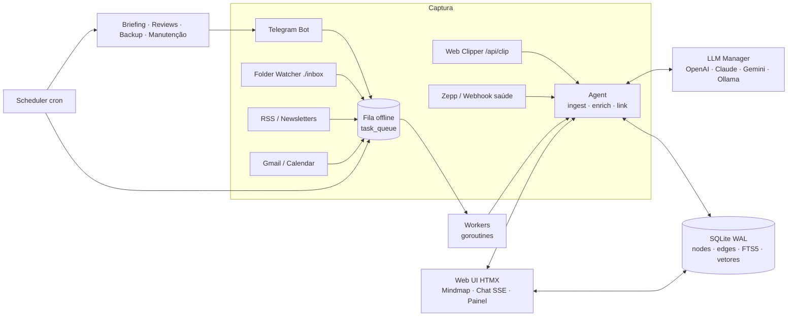

# 🧠 Second Brain

> Um "segundo cérebro" autônomo, auto-hospedado e distribuído como **binário único** em Go.
> Captura conhecimento por Telegram, web clipper, pasta monitorada, RSS, Gmail e Google Calendar, organiza tudo num **grafo de conhecimento** com IA (auto-tagging, auto-linking, busca híbrida) e trabalha por você com briefings, revisões e backups cifrados.

[](https://github.com/inakano89/second-brain/actions/workflows/ci.yml)


[](LICENSE)
[](https://github.com/inakano89/second-brain/releases)

**Open source (MIT)** · auto-hospedado · seus dados ficam na sua máquina.

---

## Sumário

- [Destaques](#destaques)
- [Arquitetura](#arquitetura)
- [Instalação](#instalação)
- [Primeiro acesso](#primeiro-acesso-setup-wizard)
- [Interface web](#interface-web)
- [Canais de captura](#canais-de-captura)
- [IA, grafo e agentes](#ia-grafo-e-agentes)
- [Integrações](#integrações)
- [Rotinas agendadas](#rotinas-agendadas)
- [Backup e restauração](#backup-e-restauração)
- [Atualizações automáticas](#atualizações-automáticas)
- [API REST](#api-rest)
- [Configuração (.env)](#configuração-env)
- [Segurança](#segurança)
- [Desenvolvimento](#desenvolvimento)
- [Limitações conhecidas](#limitações-conhecidas)
- [Contribuindo](#contribuindo)
- [Licença](#licença)

---

## Destaques

| Área | O que faz |
|---|---|
| **Binário único** | Go puro (`CGO_ENABLED=0`), templates/HTMX/CSS/JS embutidos via `embed.FS`, timezone database embutida. Roda em VPS, SBC ARM 32-bit (Armbian) e Windows. |
| **Banco** | SQLite via `modernc.org/sqlite` em modo **WAL**, índice **FTS5** (`unicode61 remove_diacritics`), grafo (`nodes`/`edges`), vetores, métricas, audit log e fila offline. |
| **LLM universal** | OpenAI, Anthropic Claude, Google Gemini e LLM local (Ollama / llama.cpp / LM Studio via API compatível com OpenAI) com **streaming**, **function calling** e **multimodal** (imagem, PDF, áudio). |
| **Grafo de conhecimento** | Nós tipados (Notas, Tarefas, Pessoas, Eventos, Insights, Artigos, Saúde), auto-tagging, extração de entidades/tarefas, auto-linking semântico, `[[wiki-links]]`. |
| **Busca híbrida** | BM25 (FTS5) + similaridade vetorial executadas em paralelo e fundidas por *Reciprocal Rank Fusion*, com filtros de tipo, data e tag. |
| **Captura multicanal** | Bot Telegram (texto, voz → transcrição, foto → OCR), bookmarklet/web clipper, pasta `inbox` (fsnotify), RSS, Gmail e newsletters. |
| **Rotinas** | Briefing matinal (sono + agenda + pendências), balanço noturno, weekly review, manutenção do SQLite e backup cifrado AES-256-GCM para local/S3/WebDAV/Telegram. |
| **Resiliência offline** | Toda chamada externa passa por uma fila persistente no SQLite com *retry* e *backoff* exponencial. |
| **Auto-update** | Instala novas releases do GitHub sozinho (SHA-256 + assinatura ed25519 opcional, snapshot do banco, rollback automático). Desativável em Configurações. |
| **Painéis** | Mindmap interativo (canvas, sem dependências), chat streaming com seletor de modelo, painel de custos por provedor, audit log, editor do `.env` e exportação para **Obsidian**. |

---

## Arquitetura



```
cmd/server/main.go            inicialização, onboarding, supervisor de serviços, rebind de porta
internal/
  config/                     .env com RWMutex + lock de arquivo + escrita atômica; schema de variáveis
  database/                   SQLite (modernc), migrações, FTS5, grafo, índice vetorial, fila, logs, métricas
  llm/                        cliente unificado (streaming SSE, tools, multimodal), embeddings, preços
  agent/                      ingestão, auto-tagging/linking, busca híbrida, chat RAG + tools, ações (webhook/MQTT/comando)
  telegram/                   bot (long polling), mídia, transcrição, OCR, notificações
  integrations/google/        OAuth2, Calendar, Gmail (+ newsletters)
  integrations/zepp/          métricas de sono/FC/passos (API Huami) + estimativa de recuperação
  integrations/rss/           parser RSS/Atom/RDF e curadoria por relevância
  watcher/                    monitor fsnotify da pasta inbox
  scheduler/                  cron interno, rotinas diárias/semanais, manutenção, backup cifrado (S3 SigV4/WebDAV/Telegram)
  queue/                      pool de workers da fila offline
  extract/                    Readability simplificado, HTML→Markdown, texto de PDF
  export/                     vault Obsidian (.zip) com frontmatter YAML e [[links]]
  crypto/                     Argon2id, AES-256-GCM em streaming
  updater/                    auto-update via GitHub Releases, verificação, troca atômica, restart e rollback
  web/                        handlers HTTP, setup wizard, SSE, templates HTMX e assets embutidos
cmd/signer/                   gera chaves e assina SHA256SUMS das releases (ed25519)
```

---

## Instalação

### Binário pré-compilado

Baixe o binário da sua plataforma em **[Releases](https://github.com/inakano89/second-brain/releases)**:

| Plataforma | Arquivo |
|---|---|
| Linux x86-64 (VPS Ubuntu/Debian) | `second-brain-linux-amd64` |
| Linux ARMv7 32-bit (Armbian, Raspberry Pi OS 32-bit, Orange Pi…) | `second-brain-linux-armv7` |
| Windows x64 | `second-brain-windows-amd64.exe` |

```bash
chmod +x second-brain-linux-amd64
mkdir -p ~/brain && cd ~/brain
~/second-brain-linux-amd64 -env ./.env
# abra http://SEU_IP:8080 → você será redirecionado para /setup
```

> Todos os caminhos relativos (`DATA_DIR`, `INBOX_DIR`, `ACTIONS_FILE`) são resolvidos a partir da pasta do `.env`.

### Docker

Imagem multi-arch (`linux/amd64`, `linux/arm/v7`) baseada em `scratch`:

```bash
docker run -d --name second-brain -p 8080:8080 -v brain-data:/data --restart unless-stopped \
  ghcr.io/inakano89/second-brain:latest
```

Ou com `docker compose up -d` usando o [`docker-compose.yml`](docker-compose.yml) do repositório.

> A imagem `scratch` não contém shell nem utilitários: ações do tipo `command` só funcionam com o binário nativo.

### Compilando do código-fonte

Requer Go 1.26+.

```bash
git clone https://github.com/inakano89/second-brain && cd second-brain
make check      # vet + testes + verifica compilação dos 3 alvos (sem gerar artefatos)
make release    # dist/second-brain-{linux-amd64,linux-armv7,windows-amd64.exe} + SHA256SUMS
make sign       # assina dist/SHA256SUMS com UPDATE_SIGNING_KEY (opcional)
make docker-buildx IMAGE=ghcr.io/voce/second-brain
```

### Serviço systemd (VPS / Armbian)

```ini
# /etc/systemd/system/second-brain.service
[Unit]
Description=Second Brain
After=network-online.target
Wants=network-online.target

[Service]
User=brain
WorkingDirectory=/opt/brain
ExecStart=/opt/brain/second-brain -env /opt/brain/.env
Restart=on-failure
RestartSec=5
NoNewPrivileges=true
ProtectSystem=strict
ReadWritePaths=/opt/brain

[Install]
WantedBy=multi-user.target
```

```bash
sudo systemctl daemon-reload && sudo systemctl enable --now second-brain
journalctl -u second-brain -f
```

Para expor na internet, use um proxy reverso com TLS (Caddy, nginx, Traefik) e defina `PUBLIC_URL=https://…`. Para SSE funcionar no nginx, desabilite buffering (`proxy_buffering off;`).

---

## Primeiro acesso (Setup Wizard)

Enquanto o `.env` não existir ou `SETUP_COMPLETED=false`, **toda requisição é redirecionada para `/setup`**. O formulário coleta:

1. **Identificação** — nome do cérebro, usuário e senha mestre (hash **Argon2id**).
2. **Servidor** — porta HTTP (padrão `8080`, migração de porta sem reiniciar), timezone, URL pública e atualizações automáticas (marcado por padrão).
3. **Provedores LLM** — chaves OpenAI, Anthropic, Gemini e endpoint local compatível com OpenAI.
4. **Telegram** — token do bot e `ALLOWED_TELEGRAM_USER_IDS`.
5. **Google Workspace** — Client ID/Secret para OAuth2 (Calendar + Gmail).
6. **Zepp / Amazfit** — e-mail/senha ou app token + user ID.
7. **Chave mestre AES-GCM** — para backups (gerada automaticamente se vazia e exibida uma única vez).

Ao concluir, são gerados `SESSION_SECRET` e `API_TOKEN`, os serviços de fundo são iniciados e você é autenticado automaticamente.

Para refazer o onboarding: `second-brain -env .env -reset-setup`.

---

## Interface web

| Página | Recursos |
|---|---|
| **Mindmap** (`/`) | Grafo force-directed em canvas (JS puro, embutido): zoom, pan, arrastar nós, duplo clique expande vizinhos, legenda filtra tipos. Busca híbrida com filtros de tipo, data e tag. Painel de detalhes com Markdown, conexões, edição, conclusão de tarefas e reprocessamento por IA. Captura rápida. |
| **Chat** (`/chat`) | Streaming via SSE, seletor dinâmico de modelo (`provedor` ou `provedor:modelo`), anexos (imagem/PDF/texto), injeção automática de contexto do grafo e chamadas de ferramentas visíveis. |
| **Painel** (`/dashboard`) | Custos e tokens por provedor/modelo (7/30/90 dias), gráfico diário, estatísticas do grafo, status das integrações, fila offline (com reprocessamento), rotinas com execução manual, métricas de saúde e último briefing. |
| **Audit log** (`/logs`) | Execuções, erros de sync, ações do agente e logins, filtráveis por nível/componente/texto. |
| **Configurações** (`/settings`) | Liga/desliga de atualizações automáticas, verificação/instalação manual, editor completo do `.env` (segredos mascarados), conexão Google, bookmarklet e API token, editor de ações do agente, backup manual, download de backups, exportação Obsidian e troca de senha. |

---

## Canais de captura

### Telegram

1. Crie um bot com [@BotFather](https://t.me/BotFather) e informe o token.
2. Envie `/start` ao bot para descobrir seu user ID e adicione-o em `ALLOWED_TELEGRAM_USER_IDS` (mensagens de outros IDs são ignoradas e registradas no audit log).

| Entrada | Comportamento |
|---|---|
| Texto livre | Conversa contínua com o assistente (histórico por chat, RAG, ferramentas). A resposta é transmitida editando a mensagem. |
| 🎙️ Voz / áudio | Download do `.ogg` → transcrição (Whisper ou Gemini Audio) → nota categorizada (pode virar tarefa/insight) → grafo. |
| 🖼️ Foto | Visão multimodal (Gemini / Claude / GPT-4o): OCR, descrição e tabelas em Markdown. |
| 📄 Documento | PDF (texto local ou OCR multimodal para digitalizados), Markdown, TXT, HTML. |
| Comandos | `/note`, `/task`, `/event` (linguagem natural → Google Calendar), `/search`, `/tasks`, `/done <id>`, `/brief`, `/model <provedor[:modelo]>`, `/reset`. |

Mídia é processada pela fila offline: sem conexão com o LLM, o bot avisa e reprocessa automaticamente.

### Web Clipper (bookmarklet)

Em **Configurações → Web Clipper**, arraste o botão **🧠 Salvar no Brain** para a barra de favoritos. Com texto selecionado, salva a seleção; sem seleção, o servidor baixa a página, extrai o conteúdo principal (Readability simplificado), gera sumário e cria o nó `article`.

### Folder watcher

Arquivos colocados em `INBOX_DIR` (padrão `./inbox`) são detectados via **fsnotify** (com *debounce* até o tamanho estabilizar) e processados: `.md` (frontmatter YAML respeitado), `.txt`, `.pdf`, `.html`, imagens e áudio. Depois vão para `inbox/.archive/AAAA-MM/` ou são apagados (`WATCHER_ACTION=delete`). Falhas permanentes vão para `.archive/failed/`.

### RSS e newsletters

`RSS_FEEDS` (um por linha) é consultado em paralelo; itens novos (≤ 7 dias) são pontuados em lote pelo LLM segundo `RSS_INTERESTS`, e os com nota ≥ `RSS_MIN_SCORE` viram artigos resumidos. Newsletters do Gmail (`GMAIL_NEWSLETTER_QUERY`) são resumidas em tópicos.

---

## IA, grafo e agentes

**Pipeline de enriquecimento** (tarefa `node.enrich`, executada em goroutines paralelas):

1. LLM extrai resumo, tags, entidades, tarefas pendentes e tipo sugerido (sem LLM: heurística local de palavras-chave, `#hashtags` e `- [ ]`).
2. Pessoas mencionadas viram nós `person` com aresta `mentions`; outras entidades são ligadas a nós existentes.
3. Tarefas implícitas viram nós `task` com aresta `derived_from`.
4. `[[wiki-links]]` viram arestas `links_to`; nós com ≥ 2 tags em comum recebem `shares_tags`.
5. Embedding é gerado e os vizinhos semânticos acima do limiar recebem arestas `related` com peso = similaridade.

**Embeddings**: OpenAI → Gemini → **embedder local** (feature hashing 512-d, zero custo, offline). Trocar de modelo re-indexa automaticamente em segundo plano.

**Function calling** disponível no chat e no Telegram:

| Ferramenta | Função |
|---|---|
| `search_brain`, `get_node` | Busca híbrida e leitura completa com vizinhos |
| `create_note`, `create_task`, `complete_task`, `list_tasks`, `link_nodes` | Gestão do grafo |
| `health_summary` | Métricas de saúde dos últimos N dias |
| `list_calendar_events`, `create_calendar_event` | Google Calendar (quando conectado) |
| `run_action` | Ações de automação da whitelist (quando `ACTIONS_ENABLED=true`) |

### Agent actions (webhooks, MQTT, comandos)

Defina ações permitidas em `actions.json` (veja [`actions.example.json`](actions.example.json)) ou pelo editor em Configurações:

```json
[
  { "name": "luz_sala", "description": "Liga/desliga a luz. input: ON|OFF", "type": "mqtt", "topic": "casa/sala/luz/set", "payload": "{{input}}" },
  { "name": "webhook_n8n", "description": "Dispara fluxo n8n", "type": "webhook", "url": "https://n8n.exemplo.com/webhook/brain", "body": "{\"msg\":\"{{input}}\"}" },
  { "name": "ping_roteador", "description": "Ping no roteador", "type": "command", "command": "ping", "args": ["-c","3","192.168.1.1"], "timeout_sec": 15 }
]
```

- `command` é executado **sem shell** (argv), com timeout e saída truncada.
- MQTT usa um cliente 3.1.1 mínimo embutido (`tcp://` ou `tls://`, QoS 0, retain opcional).
- Toda execução é registrada no audit log.

---

## Integrações

### Google Calendar & Gmail

1. No [Google Cloud Console](https://console.cloud.google.com/apis/credentials), crie um **OAuth client ID** do tipo *Web application* e habilite as APIs Calendar e Gmail.
2. Adicione o redirect URI exibido em Configurações (`<PUBLIC_URL>/google/callback`).
3. Informe Client ID/Secret e clique em **Conectar Google**.

- Eventos de ontem a +14 dias são espelhados como nós `event` (`CRON_CALENDAR`).
- E-mails de `GMAIL_QUERY` são triados pelo LLM: pendências viram tarefas ligadas à nota do e-mail.
- Criação de eventos em linguagem natural: `/event amanhã 15h reunião com Ana no escritório`.

### Zepp Health / Amazfit

Polling (`CRON_ZEPP`) de duração de sono (profundo/leve/REM), pontuação de sono, FC em repouso e passos. Se o provedor não fornecer **pontuação de recuperação**, ela é estimada (0–100) a partir do sono e da FC em repouso vs. linha de base de 14 dias. Cada dia vira um nó `health` e alimenta o briefing matinal.

Alternativa sem credenciais Zepp: envie métricas pelo **webhook** (Gadgetbridge, Tasker, Health Connect, Home Assistant…):

```bash
curl -X POST https://brain.exemplo.com/api/health/webhook \
  -H "Authorization: Bearer $API_TOKEN" \
  -d '{"date":"2026-09-28","source":"gadgetbridge","metrics":{"sleep_minutes":452,"deep_sleep_minutes":95,"sleep_score":84,"resting_hr":54,"steps":10234}}'
```

---

## Rotinas agendadas

Cron de 5 campos no timezone configurado (aceita `*/n`, intervalos, listas, nomes e `@daily`/`@hourly`…). Use `off` para desativar. Todas podem ser disparadas manualmente no Painel.

| Job | Variável | Padrão | Descrição |
|---|---|---|---|
| `morning` | `CRON_MORNING` | `0 7 * * *` | Briefing matinal: sono/recuperação + agenda + tarefas atrasadas/do dia → Telegram e painel |
| `evening` | `CRON_EVENING` | `0 21 * * *` | Balanço do dia: concluídas, capturas, erros, custo |
| `weekly` | `CRON_WEEKLY` | `0 18 * * 0` | Weekly review: nós órfãos, links quebrados, pendências paradas; re-linka órfãos e reindexa embeddings |
| `maintenance` | `CRON_MAINTENANCE` | `30 3 * * *` | Purga de temporários de voz/imagem, tarefas e logs antigos; `incremental_vacuum`, `optimize`, FTS optimize, checkpoint WAL (VACUUM completo aos domingos) |
| `backup` | `CRON_BACKUP` | `0 4 * * *` | Snapshot cifrado para os destinos configurados |
| `rss` / `gmail` / `calendar` / `zepp` | `CRON_*` | 30 / 15 / 30 min / 4 h | Enfileiram sincronizações (com retry offline) |
| `update` | `CRON_UPDATE` | `40 4 * * *` | Verifica releases no GitHub e instala se `AUTO_UPDATE_ENABLED=true` (senão só notifica) |

---

## Backup e restauração

1. `VACUUM INTO` gera um snapshot consistente sem bloquear o uso.
2. O arquivo é cifrado em streaming com **AES-256-GCM** (chunks de 64 KiB autenticados contra reordenação/truncamento; chave derivada de `BACKUP_ENCRYPTION_KEY` via Argon2id com salt aleatório).
3. É enviado em paralelo para `BACKUP_TARGETS`: `local` (rotação `BACKUP_KEEP`), `s3` (AWS SigV4 — AWS, MinIO, Cloudflare R2, Backblaze B2, Wasabi), `webdav` (Nextcloud etc.) e `telegram` (chat privado, até 50 MB).

Restaurar:

```bash
second-brain -decrypt second-brain-20260928-040000.db.enc -out brain.db -key "SUA_CHAVE"
# pare o serviço, substitua data/brain.db pelo arquivo restaurado e inicie novamente
```

**Exportação Obsidian**: Configurações → *Exportar vault Obsidian* gera um `.zip` com pastas por tipo, frontmatter YAML (id, tipo, tags, datas, status, prazo, URL, resumo) e seção **Conexões** com `[[wiki-links]]` para cada aresta.

---

## Atualizações automáticas

O servidor acompanha as [releases do GitHub](https://github.com/inakano89/second-brain/releases) e se atualiza sozinho. **Vem ativado por padrão** e pode ser desligado a qualquer momento em **Configurações → Atualizações** (botão liga/desliga) ou com `AUTO_UPDATE_ENABLED=false`.

Fluxo de cada atualização (`CRON_UPDATE`, padrão diário às 04:40, após o backup):

1. Consulta `GET /repos/{UPDATE_REPO}/releases/latest` (ou a pré-release mais nova com `UPDATE_CHANNEL=prerelease`).
2. Baixa o binário da plataforma (`second-brain-linux-amd64`, `-linux-armv7` ou `-windows-amd64.exe`) e o `SHA256SUMS`.
3. Confere o **SHA-256**; se o binário foi compilado com `UPDATE_PUBLIC_KEY`, exige também `SHA256SUMS.sig` com **assinatura ed25519** válida.
4. Executa `binário-novo -version` como teste de sanidade.
5. Salva um snapshot do banco em `data/backups/pre-update-<versão>.db`.
6. Troca o executável de forma atômica (o anterior fica em `second-brain.old`) e reinicia o processo com os mesmos argumentos (`exec` no Linux; novo processo no Windows).
7. A nova versão é confirmada após 90 s no ar. **Se falhar em 3 inicializações seguidas, o binário anterior é restaurado** e a versão defeituosa entra numa lista de bloqueio (`second-brain.skip`).

Você é avisado pelo Telegram (instalação iniciada, concluída ou versão nova disponível quando a instalação automática está desligada). O rodapé da interface também mostra quando há versão nova.

| Situação | Comportamento |
|---|---|
| Docker | Não substitui o binário da imagem; mostra/notifica a versão nova. Use `docker pull` ou Watchtower. |
| Build de desenvolvimento (`go run`, `version=dev`) | Apenas verificação, sem instalação. |
| Pasta do executável sem permissão de escrita | Apenas verificação. No systemd, inclua o diretório em `ReadWritePaths`. |

Pela linha de comando: `second-brain -env .env -update` verifica, instala e sai (reinicie o serviço em seguida).

**Para mantenedores de forks**: gere um par de chaves com `go run ./cmd/signer keygen`, cadastre a pública como *variable* `UPDATE_PUBLIC_KEY` e a privada como *secret* `UPDATE_SIGNING_KEY`. O workflow de release assina o `SHA256SUMS` e embute a chave pública nos binários. Aponte `UPDATE_REPO` para o seu `owner/repo`.

---

## API REST

Autenticação: cookie de sessão **ou** `Authorization: Bearer <API_TOKEN>` (também aceito como `?token=`/campo de formulário no clipper).

| Método | Rota | Descrição |
|---|---|---|
| `POST` | `/api/clip` | Salva página/seleção. JSON ou form: `url`, `title`, `html`, `text`, `note`, `tags`. CORS habilitado. |
| `POST` | `/api/nodes` | Cria nó: `{"type","title","content","tags":[],"due":"YYYY-MM-DD[THH:MM]"}` |
| `POST` | `/api/health/webhook` | Métricas diárias (objeto ou lista) |
| `GET` | `/api/search?q=&types=&from=&to=&tag=&limit=` | Busca híbrida (sessão) |
| `GET` | `/api/graph?q=&focus=&types=&limit=` | Subgrafo para visualização (sessão) |
| `POST` | `/api/chat` | Chat SSE (`message`, `provider`, `file`) — eventos `context`, `token`, `tool_call`, `tool_result`, `done`, `error` (sessão) |
| `GET` | `/healthz` | Liveness |

---

## Configuração (.env)

O `.env` é lido e gravado com lock (`RWMutex` + arquivo `.env.lock` exclusivo) e escrita atômica (arquivo temporário + `rename`), preservando comentários. Precedência: **valor no `.env` → variável de ambiente → padrão**. Referência completa em [`.env.example`](.env.example).

| Grupo | Principais variáveis |
|---|---|
| Geral | `BRAIN_NAME`, `HTTP_HOST`, `HTTP_PORT`, `PUBLIC_URL`, `TIMEZONE`, `DATA_DIR`, `INBOX_DIR`, `WATCHER_ENABLED`, `WATCHER_ACTION`, `QUEUE_WORKERS`, `LOG_RETENTION_DAYS` |
| LLM | `DEFAULT_LLM_PROVIDER`, `OPENAI_API_KEY`/`OPENAI_MODEL`/`OPENAI_BASE_URL`, `ANTHROPIC_API_KEY`/`ANTHROPIC_MODEL`, `GEMINI_API_KEY`/`GEMINI_MODEL`, `OLLAMA_BASE_URL`/`OLLAMA_MODEL`, `EMBEDDING_PROVIDER`, `MULTIMODAL_PROVIDER`, `LLM_PRICING`, `AUTOLINK_THRESHOLD` |
| Telegram | `TELEGRAM_BOT_TOKEN`, `ALLOWED_TELEGRAM_USER_IDS` |
| Google | `GOOGLE_CLIENT_ID`, `GOOGLE_CLIENT_SECRET`, `GOOGLE_CALENDAR_ID`, `GMAIL_QUERY`, `GMAIL_NEWSLETTER_QUERY` |
| Zepp | `ZEPP_EMAIL`, `ZEPP_PASSWORD` ou `ZEPP_APP_TOKEN` + `ZEPP_USER_ID`, `ZEPP_API_BASE` |
| RSS | `RSS_FEEDS`, `RSS_INTERESTS`, `RSS_MIN_SCORE`, `RSS_MAX_ITEMS` |
| Backup | `BACKUP_ENCRYPTION_KEY`, `BACKUP_TARGETS`, `BACKUP_KEEP`, `S3_*`, `WEBDAV_*`, `BACKUP_TELEGRAM_CHAT_ID` |
| Automação | `ACTIONS_ENABLED`, `ACTIONS_FILE`, `MQTT_BROKER`, `MQTT_USERNAME`, `MQTT_PASSWORD`, `MQTT_CLIENT_ID` |
| Atualizações | `AUTO_UPDATE_ENABLED`, `UPDATE_CHANNEL`, `UPDATE_REPO` |
| Agendamentos | `CRON_MORNING`, `CRON_EVENING`, `CRON_WEEKLY`, `CRON_MAINTENANCE`, `CRON_BACKUP`, `CRON_RSS`, `CRON_GMAIL`, `CRON_CALENDAR`, `CRON_ZEPP`, `CRON_UPDATE` |

**Modelos padrão** (editáveis): `gpt-4o-mini`, `claude-opus-5`, `gemini-2.5-flash`, `llama3.1`. No chat é possível usar qualquer modelo com `provedor:modelo` (ex.: `anthropic:claude-sonnet-5`, `openai:gpt-4.1`, `ollama:qwen2.5`).

**Custos**: estimados por tabela de preços (USD por 1M tokens, correspondência pelo maior prefixo do nome do modelo). Sobrescreva com `LLM_PRICING='{"meu-modelo":[0.5,1.5]}'`.

Alterações feitas pelo editor web são aplicadas na hora: clientes LLM, ações e serviços de fundo são reiniciados, e mudanças de `HTTP_PORT`/`HTTP_HOST` migram o listener sem derrubar o processo. `DATA_DIR` exige reinício.

---

## Segurança

- Senha com **Argon2id**; sessão em cookie `HttpOnly`/`SameSite=Lax` assinado com HMAC-SHA256 (`Secure` quando `PUBLIC_URL` é HTTPS).
- Limite de tentativas de login (5 falhas / 10 min por IP).
- Proteção CSRF por verificação de `Origin`; CSP restritiva (`script-src 'self'`, sem scripts inline), `X-Frame-Options: DENY`.
- Whitelist estrita de usuários no Telegram; API token com comparação em tempo constante e rotação pela UI.
- Markdown renderizado com escape total de HTML; segredos nunca são reexibidos na UI.
- Ações do agente limitadas a uma whitelist explícita, desativadas por padrão, sem shell.
- Backups cifrados com autenticação (AES-GCM); a chave nunca sai do `.env`.
- Auto-update só instala binários que conferem com o `SHA256SUMS` (e com a assinatura ed25519 quando configurada), com rollback automático.

Vulnerabilidades: veja [SECURITY.md](SECURITY.md) (relato privado via GitHub Security Advisories).

Recomendado: servir atrás de proxy reverso com TLS e manter o `.env` com permissão `600` (o próprio servidor grava assim).

---

## Desenvolvimento

```bash
make run        # go run ./cmd/server -env .env
make test       # testes unitários + end-to-end HTTP (setup → login → grafo → export)
make check      # vet + testes + compilação dos 3 alvos
SB_DEBUG=1 make run   # logs em nível debug
```

Estrutura de testes: parsing SSE de cada provedor com servidores mock (incluindo replay de blocos de raciocínio do Claude e `thoughtSignature` do Gemini), cron, criptografia em streaming, FTS5/grafo/fila no SQLite, Readability, RSS/Atom e fluxo web completo.

---

## Limitações conhecidas

- A integração Zepp usa a API de nuvem **não oficial** da Huami e pode mudar sem aviso; o webhook de saúde é a alternativa estável.
- O Bot API do Telegram limita downloads a 20 MB e uploads a 50 MB (backups maiores devem usar S3/WebDAV).
- O embedder local é léxico-semântico (hashing); para similaridade semântica real configure embeddings OpenAI, Gemini ou Ollama.
- A transcrição de voz requer OpenAI (Whisper) ou Gemini.
- No Windows, o auto-update reinicia o processo em primeiro plano; se rodar como serviço (NSSM/sc), prefira desativar o auto-update ou configure o serviço para reiniciar automaticamente.

---

## Contribuindo

Contribuições são bem-vindas! Leia o [CONTRIBUTING.md](CONTRIBUTING.md): `make check` deve passar, novas variáveis entram em `internal/config/schema.go` e migrações de banco são somente aditivas. Bugs e ideias: [issues](https://github.com/inakano89/second-brain/issues).

## Licença

[MIT](LICENSE) © 2026 inakano89 e contribuidores.
